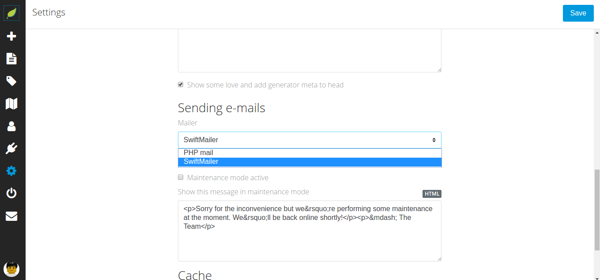
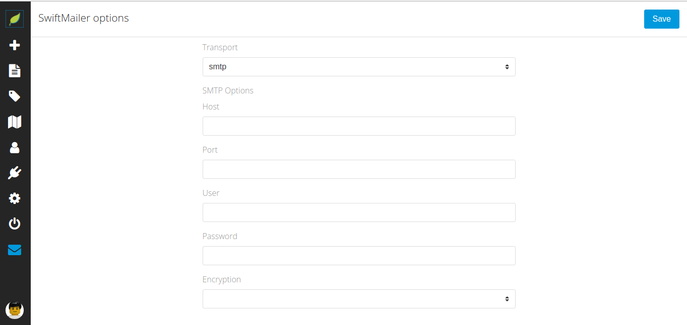

# 

# SwiftMailer
Adds Swift Mailer as possible mailer to [Leafpub](https://github.com/Leafpub/leafpub)

## How do I enable SwiftMailer?

After you activated the plugin, open Leafpub settings and switch to the advanced tab.
Scroll down to "Sending e-mails" and choose "Swift Mailer".

## Which transport options are supported?

Swift Mailer supports 3 transport options out of the box. They are all supported.
You can choose between
- mail
- sendmail
- smtp

To send emails via smtp you must set further settings.

## License

©2017 [Marc](https://github.com/karsasmus)

This software is copyrighted. You may use it under the terms of the GNU GPLv3 or later. See LICENSE.md for licensing details.

All code is copyright 2017 Marc except where noted. Third-party libraries are copyrighted and licensed by their respective owners.